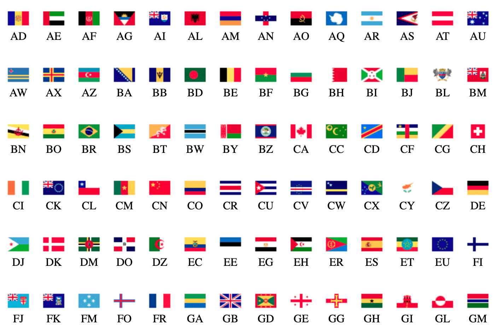

# Countries Flag


https://freeshineit.github.io/countries-flag

https://freeshineit.github.io/countries-flag/index-code.html

https://freeshineit.github.io/countries-flag/index-64.html

https://freeshineit.github.io/countries-flag/index-code-64.html

[demo](./docs/index.html)


## Install

With NPM

> npm install countries-flag

With Yarn

> yarn install countries-flag

## Use

CSS

```css
/* 32px */
@import 'countries-flag';

/* 64px */
/* @import 'countries-flag/lib/flags-64.css' */

.flag {
   /*  download image */
   background-image: url(./flags.png);
   /* background-image: url(./flags-64.png); */
}
```

Sass

```scss
/* 32px */
@import 'countries-flag/index.scss';

/* 64px */
/* @import 'countries-flag/lib/flags-64.scss' */

.flag {
   /*  download image */
   background-image: url(./flags.png);
   // background-image: url(./flags-64.png);
}
```


Vue/React

```tsx
import bg from 'countries-flag/lib/flags.png'

// ...

<span className="flag flag-cn" style={{backgroundImage: `url(${bg})`}}></span>
// <span className="flag flag-86" style={{backgroundImage: `url(${bg})`}}></span>
```

HTML

```html
    <!-- China flag -->
    <span class='flag flag-cn'></span>

   <!-- support phone code -->
   <!-- @import 'countries-flag/lib/flags-iso-code.css' or @import 'countries-flag/lib/flags-code.css'-->
    <span class='flag flag-86'></span>
```